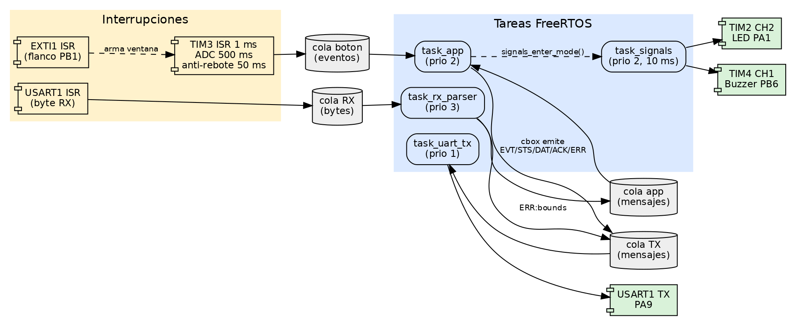
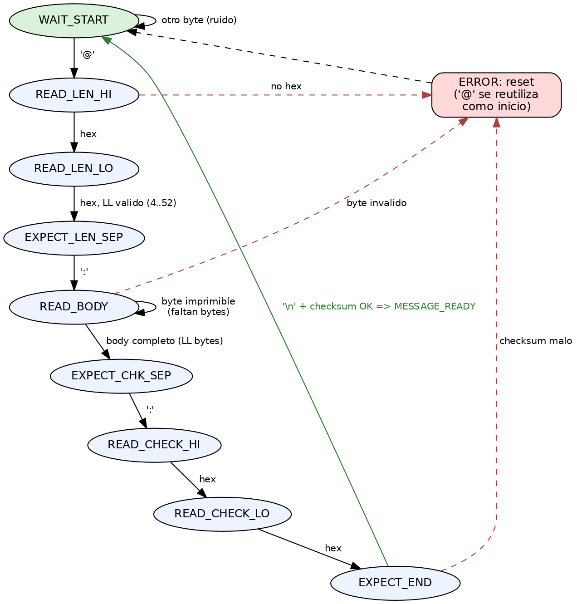
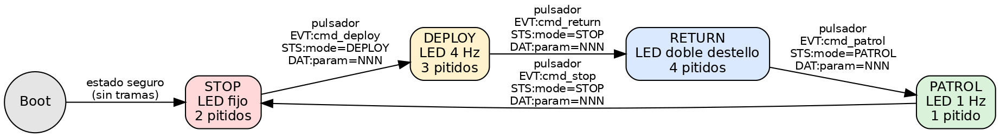
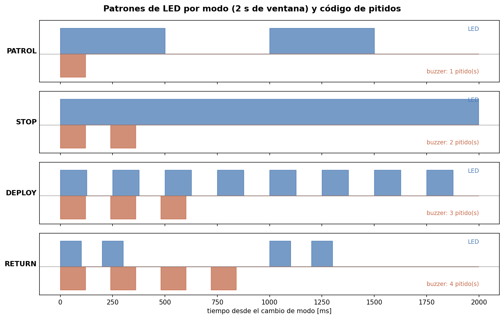
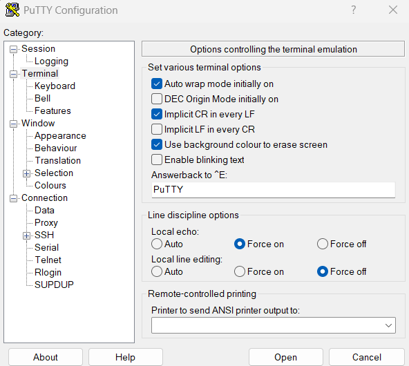
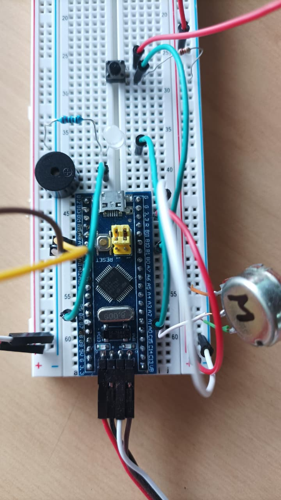
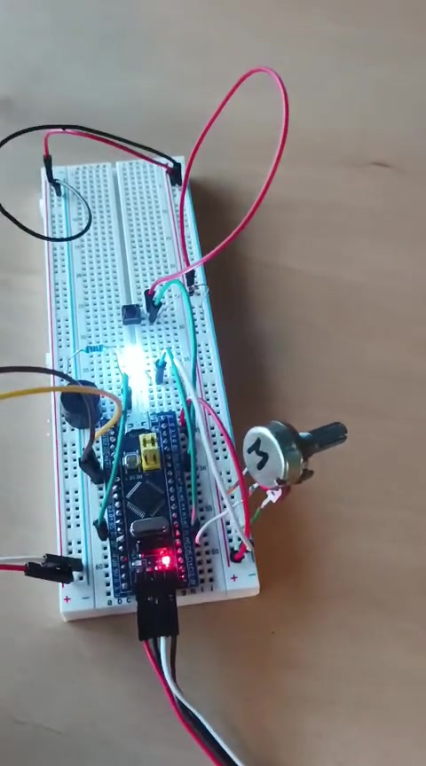
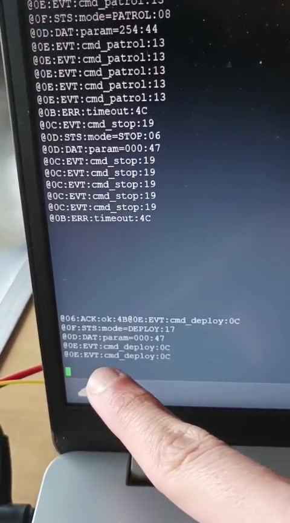
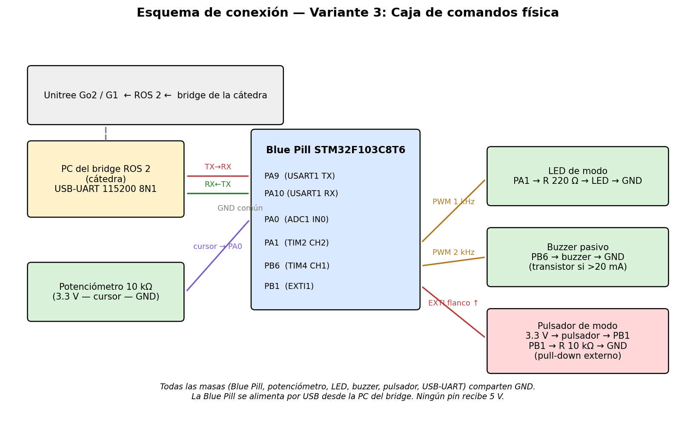

# TP Integrador — Variante 3: Caja de comandos física

**Sistemas Embebidos (3.3.127) — UADE**
Integrantes: Borda, Rojas y Castiglioni

La Blue Pill (STM32F103C8T6) implementa una caja de comandos física para un
robot Unitree Go2/G1 a través del bridge ROS 2 de la cátedra. Un pulsador
cicla los modos PATROL → STOP → DEPLOY → RETURN; un potenciómetro define el
parámetro auxiliar (0–255) que acompaña cada comando. LED y buzzer señalizan
el modo activo.

## Estructura

```
firmware/            Código fuente (FreeRTOS + libopencm3)
  main.c             Punto de entrada
  config/            app_config.h (parámetros) + FreeRTOSConfig.h
  drivers/           uart_comm (USART1) + board_io (ADC, PWM, EXTI, TIM3)
  protocol/          protocol.c (framing/checksum) + parser.c (FSM)
  app/               command_box (lógica variante) + signals (patrones) + tasks
  third_party/       linker.ld (incluido) + libopencm3/FreeRTOS (ver README)
tests/               Tests de host (gcc): 67 casos + verificación de configuración RTOS
tools/bridge_sim.py  Bridge simulado por puerto serie (responde ACK:ok)
evidencia/           Capturas de tests, FSM, ADC y sesión simulada
diagramas_varios/    Estados, parser, tareas, conexión, patrones y PuTTY (PNG)
informe/             Informe técnico (docx + pdf)
```

Las fuentes editables de los diagramas de flujo actuales están en
[`diagramas_propios/`](diagramas_propios/README.md). Describen tareas, parser,
transacción de ACK y periféricos a partir del código del firmware.

## Arquitectura y comportamiento

La arquitectura separa las interrupciones breves, las colas de FreeRTOS y la
lógica de aplicación para mantener la recepción UART y el botón desacoplados.



El parser incremental consume un byte por vez, valida longitud y checksum, y
puede resincronizarse ante ruido o una trama incompleta.



La caja de comandos recorre los cuatro modos de la variante y el motor de
señales transforma el modo activo en los patrones visibles y audibles.





## Compilar el firmware

1. Obtener dependencias (una sola vez): ver `firmware/third_party/README.md`.
2. `cd firmware && make` → genera `bin/main.elf`, `.hex` y `.bin`.
3. Flasheo con ST-Link: `make flash` (usa OpenOCD).

## Correr los tests de host (sin hardware)

```
cd tests
make run    # 67 tests de protocolo, parser, variante y señales + chequeo RTOS
make fsm    # recorrido estado por estado de la FSM (evidencia Etapa 1)
make sim    # sesión simulada de ~25 s con reintentos de ACK (Etapa 3)
```

## Diagnóstico FreeRTOS

El arranque verifica que todas las colas y tareas se hayan creado. Además,
el firmware detecta falta de heap y desborde de pila; ante cualquiera de esos
fallos se detiene para evitar corrupción adicional. Con ST-Link/GDB se puede
inspeccionar `g_rtos_fatal_reason` y, si corresponde,
`g_rtos_overflow_task`.

## Probar contra un bridge simulado (con hardware, sin robot)

```
pip install pyserial
python3 tools/bridge_sim.py COM5            # responde ACK:ok a cada EVT
python3 tools/bridge_sim.py COM5 --no-ack   # escenario de falla (timeout)
```

## Prueba manual UART con PuTTY

Configurar una sesión serie sobre el puerto `COM` del adaptador USB-UART con
`115200` baudios, `8N1`, paridad `None` y control de flujo `None`.

En **Terminal** usar:

- `Implicit CR in every LF`: activado. Solo mejora la visualización: el
  firmware continúa transmitiendo el `LF` exigido por el protocolo, pero
  PuTTY vuelve al inicio de la línea y evita una consola en diagonal.
- `Local echo`: `Force on`, para ver las tramas que se escriben.
- `Local line editing`: `Force off`, para enviar cada byte inmediatamente.

Configuración de referencia:



La trama debe finalizar con `LF`. En PuTTY se envía con `Ctrl+J`; presionar
solamente Enter suele enviar `CR` y no completa una trama. Por ejemplo:

```text
@08:CMD:ping:52<Ctrl+J>
```

La Blue Pill confirma una trama válida recibida con:

```text
@06:ACK:ok:4B
```

Al presionar el botón, la aplicación envía `EVT`, `STS` y `DAT`. Para evitar
el reenvío del `EVT` cada 500 ms y el posterior `ERR:timeout`, responder:

```text
@06:ACK:ok:4B<Ctrl+J>
```

Las tramas inválidas, por ejemplo `@08:CMD:ping:00<Ctrl+J>`, deben producir
`@0A:ERR:bounds:35`.

## Evidencia del prototipo

El montaje físico validó localmente UART, parser, pulsador con anti-rebote,
potenciómetro/ADC, LED PWM y buzzer. Esta evidencia demuestra el
funcionamiento autocontenido de la Blue Pill; la integración con ROS 2 y el
robot queda sujeta a la disponibilidad del laboratorio de la cátedra.



<p align="center">
  
  
</p>

De izquierda a derecha: operación del prototipo durante la prueba de ADC,
EXTI y FSM; y confirmación `ACK:ok` sobre UART luego de un evento.

- [Video: ADC, EXTI y FSM](evidencia/TPI_V3_ADC_EXTI_FSM.mp4): interacción
  entre potenciómetro, pulsador y señalización de la caja de comandos.
- [Video: intercambio de ACK por UART](evidencia/TPI_V3_Acknowledge.mp4):
  confirmación de eventos y comportamiento del enlace serie.

## Conexionado

| Pin Blue Pill | Función | Periférico |
|---|---|---|
| PA9  | USART1 TX | USB-UART del bridge (115200 8N1) |
| PA10 | USART1 RX | USB-UART del bridge |
| PA0  | ADC1 IN0 | Potenciómetro 10 kΩ (3.3 V — cursor — GND) |
| PA1  | TIM2 CH2 (PWM 1 kHz) | LED + R 220 Ω a GND |
| PB6  | TIM4 CH1 (PWM 2 kHz) | Buzzer pasivo a GND |
| PB1  | EXTI1 | Pulsador a 3.3 V + pull-down externo 10 kΩ |

Todas las masas comparten GND. La Blue Pill opera a 3.3 V: ningún pin
recibe 5 V. Alimentación por USB desde la PC del bridge.


